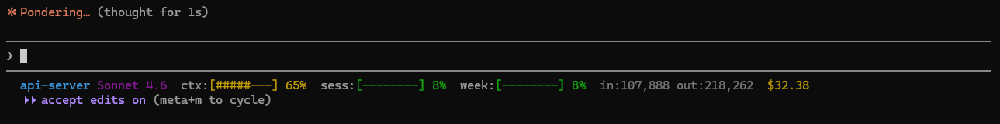

# claude-plugins

Personal Claude Code plugin marketplace by [BingSyuan](https://github.com/SyXuan).

## Add this marketplace

**Step 1** — Register the marketplace (once per machine):

```
/plugin marketplace add SyXuan/claude-plugins
```

Or manually add to `~/.claude/settings.json`:

```json
{
  "extraKnownMarketplaces": {
    "SyXuan": {
      "source": {
        "source": "github",
        "repo": "SyXuan/claude-plugins"
      }
    }
  }
}
```

**Step 2** — Install a plugin:

```
/plugin install <name>@SyXuan
```

## Available Plugins

### `usage-statusline`

Displays real-time usage in Claude Code status bar:



```
ClaudeCode  Sonnet 4.6  ctx:[###-----] 38%  sess:[##------] 25%  week:[--------] 4%  in:45,231 out:12,048  $1.23
```

| Field | Description |
|-------|-------------|
| `ctx` | Context window usage (current conversation) |
| `sess` | Session rate limit (~5 hr window) |
| `week` | Weekly rate limit |
| `in/out` | Cumulative token counts |
| `$cost` | Estimated session cost |

**Install:**
```
/plugin install usage-statusline@SyXuan
/usage-statusline:setup
```

**Requirements:** Claude Code with claude.ai subscription (OAuth login), Python 3.x
